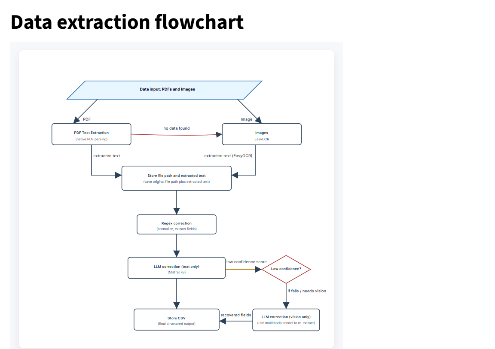

# Automated Invoice Extraction

## Overview

This project implements a complete machine learning pipeline for intelligent invoice data extraction and modeling.
It processes a Google Drive folder containing invoices (PDF and image formats), extracts structured fields, stores them in a normalized schema, and allows querying and visualization through a Streamlit dashboard.

---

## Objective

To automate financial operations by:

1. Extracting invoice-level and line-item data from unstructured documents.
2. Normalizing, validating, and storing the results in structured form.
3. Leveraging LLMs to enhance accuracy where OCR or regex fails.

---

## Pipeline Overview

The following flowchart illustrates the full processing pipeline:



---

## Components

### 1. Data Preparation

All files were initially PDFs. To simulate mixed input formats, 50% of the PDFs were randomly selected (with a fixed seed) and converted to JPG images. Both file types are kept in the dataset to ensure consistency with the task specification.

---

### 2. Text Extraction

**PDF Path**

* Uses PyPDF2 for native text extraction.
* If sufficient text is found (≥10 characters), the result is stored directly.
* If text is missing or incomplete, the file is redirected to the image extraction path.

**Image Path**

* Converts all inputs to lossless PNG using Pillow.
* Runs EasyOCR for text extraction.
* Returns extracted text and the normalized image path.

This separation avoids running OCR unnecessarily on text-based PDFs and ensures efficient handling of both formats.

---

### 3. Fallback Mechanism

Some PDFs are scanned documents without a text layer.
For those, the system automatically falls back to the image pipeline.
Each page is rendered as an image, processed with OCR, and the text is aggregated.
This ensures that every file yields usable text, regardless of its internal structure.

---

### 4. Regex Cleaning

Regex cleaning standardizes raw text into structured fields.

**Outputs**

* `regex_invoices.csv`: invoice-level data
  Columns: `file_path`, `invoice_id`, `vendor`, `date`, `total`, `invoice_number`
* `regex_lineitems.csv`: line-item data
  Columns: `file_path`, `invoice_id`, `description`, `quantity`, `unit_price`, `total`

This step enforces schema consistency and prepares data for model-based enhancement.

---

### 5. LLM-Based Enhancement

To improve accuracy and handle ambiguous extractions, an LLM correction layer refines the structured output.

**Option A: Gemini 1.5 Flash (Text)**

* Takes OCR and regex-cleaned text as input.
* Reconstructs structured JSON with confidence scores.
* If confidence or validation fails, triggers fallback.

**Option B: Gemini 1.5 Flash (Vision + LLM)**

* Uses the document image as an additional input.
* Corrects field-level inconsistencies and misread text.

This hybrid approach minimizes compute cost while ensuring completeness and accuracy.

---

### 6. Data Modeling

The final data is stored either as CSV files or a SQLite database with two linked tables:

* Invoices table (vendor, date, total, invoice number)
* LineItems table (linked via invoice_id)

Validation ensures consistent date formats, numeric parsing, and referential integrity between tables.

---

### 7. Streamlit Dashboard

A light-mode Streamlit dashboard displays results and enables basic analysis.

**Queries Supported**

* List all invoices from a specific vendor within a date range.
* Show total spend by vendor.
* Identify invoices with missing totals or invalid dates.

Visualizations are created using Matplotlib, and the layout uses a white background, black text, and a light gray sidebar.

---

## Tech Stack

| Component      | Library                                   | Purpose                               |
| -------------- | ----------------------------------------- | ------------------------------------- |
| Language       | Python                                    | Core implementation                   |
| PDF Processing | PyPDF2                                    | Native text extraction                |
| OCR            | EasyOCR, Pillow                           | Image text extraction                 |
| Regex Cleaning | re, WordNinja                             | Text normalization and vendor parsing |
| LLM Layer      | Google Gemini 1.5 Flash (Text and Vision) | Intelligent correction                |
| Data Handling  | Pandas, NumPy                             | Tabular data processing               |
| Visualization  | Matplotlib, Streamlit                     | Dashboards and charts                 |
| Storage        | SQLite                                    | Structured persistence                |

---

## Model Rationale

* EasyOCR is chosen for its simplicity and low resource use. Since a downstream LLM validates and corrects fields, high OCR precision is not required.
* Splitting the pipelines avoids redundant computation.
* Fallback logic ensures every file produces meaningful output.
* The LLM hierarchy (Text → Vision fallback) balances speed and accuracy.

---

## Trade-offs and Discussion

| Approach           | Strengths                        | Limitations                  |
| ------------------ | -------------------------------- | ---------------------------- |
| Regex Only         | Fast, transparent                | Fails with irregular layouts |
| OCR + LLM          | Context-aware, language-flexible | Dependent on OCR accuracy    |
| Vision + LLM       | Understands layout structure     | High cost and latency        |
| Hybrid (used here) | Balanced accuracy and efficiency | Requires orchestration logic |

---

Here is the revised **Limitations and Future Work** section with your requested changes applied precisely, maintaining technical clarity and professional tone.

---

## Limitations and Future Work

* Currently supports English text only, but the code is structured in a way that additional language models can be integrated easily.
* Does not process handwritten invoices because there was no practical need in the given dataset, but support for handwriting recognition can be added with minimal effort by extending the OCR module.
* High dependency on the Gemini API key. If the API cost increases or reliability decreases, it could affect scalability. However, the codebase is modular and can be quickly adapted to use an open-source or local LLM alternative with minimal modification.
* LayoutLMv3 fine-tuning could further improve accuracy, but it was intentionally excluded since the system performs reliably with Gemini-based processing, and additional complexity or compute cost was not justified.

All these limitations are practical rather than structural. The pipeline is designed in a way that these improvements can be implemented easily if requirements change or if a production-grade deployment demands them.

---

## Evaluation

Evaluation is performed on a small subset of 15 labeled invoice files.  
Performance is measured by runtime per document and extraction completeness.  

Invoice-level average:  Precision: 0.896, Recall: 0.883, F1: 0.890, Accuracy: 0.813
Line-item average: 0.897, Recall: 0.867, F1: 0.881, Accuracy: 0.791

---
n
## Installation and Setup

1. Create a virtual environment:
   ```bash
   python -m venv .venv
````

2. Activate the environment:

   ```bash
   # Windows
   .venv\Scripts\activate

   # macOS/Linux
   source .venv/bin/activate
   ```

3. Install dependencies:

   ```bash
   pip install -r requirements.txt
   ```

4. Run the Streamlit app:

   ```bash
   streamlit run app.py
   ```

```

